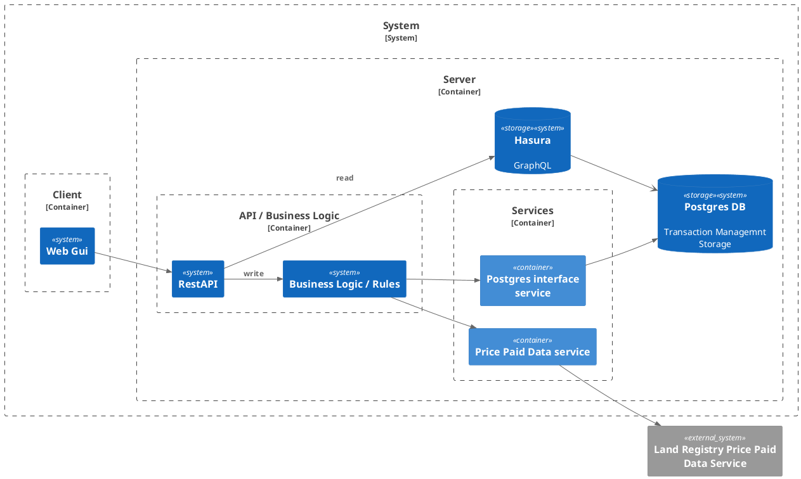

## Goal
This is is a system to obtain Price Paid Data from the UK Government Price Paid Data Service.
The system comprises of 3 major components, the Client, Server and Interface Services.

* Client : A Web GUI that will show the property data on a LeafletJS map surface.
* Server: 
	* Domain : Business Rules and Logic
		* API - OpenAPI interface
		* Business Rules / Logic
	* Services : External service integrations
		* Postgres DB 
		* Price Paid Data 
###  System 

#### Operation 

##### Data Maintenance
1. On startup the application will look into the Postgres Database and find the most recent records date.
	1. If there are no records then the system will download information from the Price Paid Data service, a year at a time, from 1995 to the present day,
	2. If there are records :-
		1. If the record is from this year then download the current years file and upsert it into the database. ( The current years file is added to on a monthly basis)
		2. If the record is from a previous year then download yearly files until you reach the current year.
2. Every Month download the current years file and upsert the data into the database.

##### Client 
1. The Client is a JavaScript based Web GUI
2. The Client will display property data on a LeafletJS map surface.
3. On Startup the Client will not retrieve any information.
4. The Client will have a filter panel. Filters are available to reduce the returned dataset.
	1. Ability to select 1 or more years.
	2. Ability to set a postcode.
		1. The user should be able to enter a partial postcode, such as W1, GU22 etc.
	3. Ability to select a property type, such as 'Detached', 'Semi-Detached', etc. etc.
	
## Acceptance Criteria
- [ ] Criterion 1
- [ ] Criterion 2

## Out of Scope
[What this spec deliberately does not cover]
