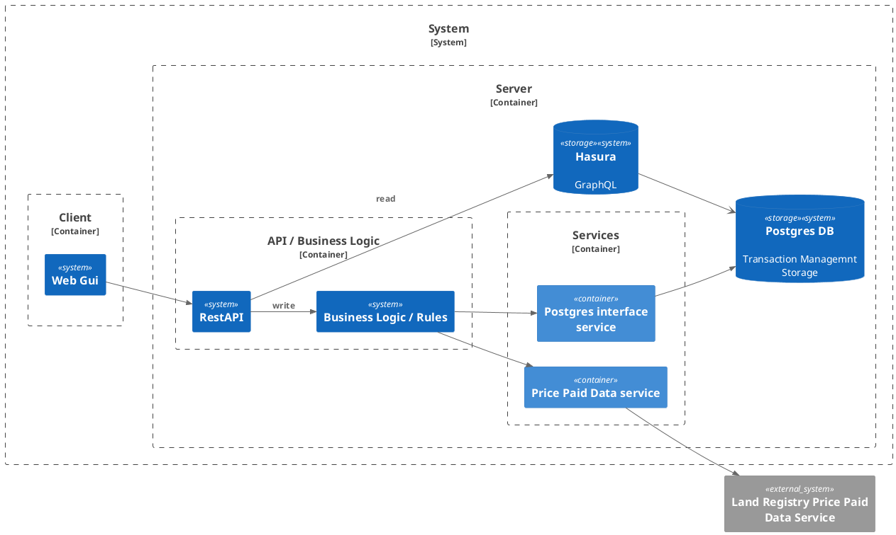

## Goal
[What are we trying to achieve?]

1. Postgres DB server will be in a container
2. Hasura GraphQL server will be in a container
3. The Client, Business Logic and Services will be in a container.
4. API will be a Azure Function with a OpenAPI interface.
5. There will be a deployment script written in Bicep
6. The application will be built for Azure.
7. The applications will be able to be run locally.

## Acceptance Criteria
- [ ] Criterion 1
- [ ] Criterion 2

## Out of Scope
[What this spec deliberately does not cover]
